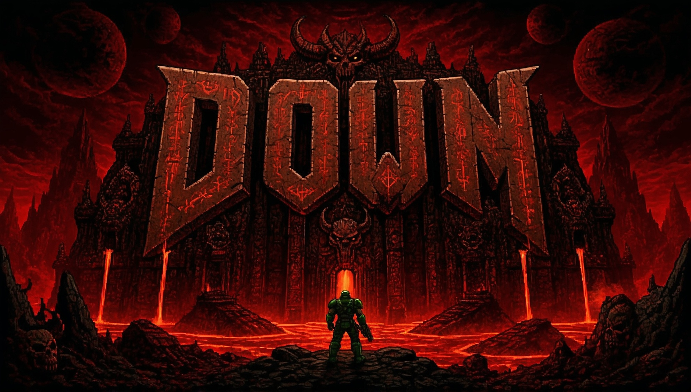
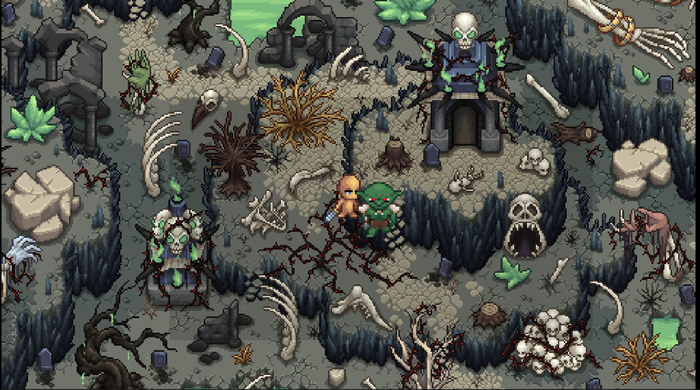
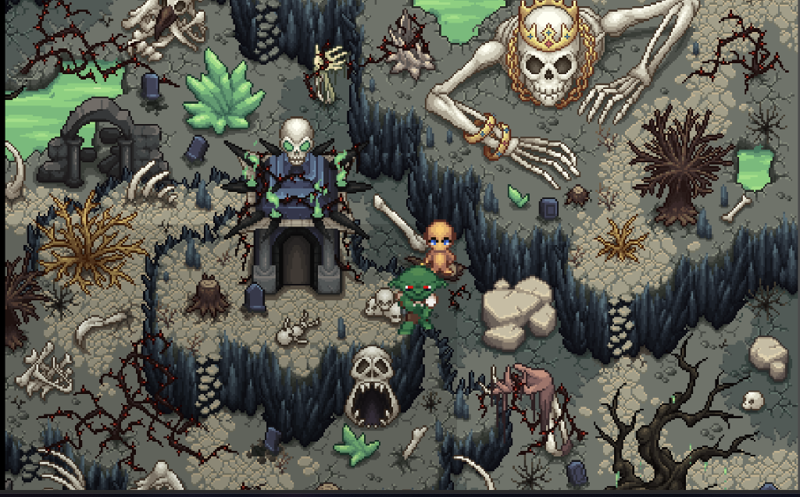

# DOWN - 💀 Dark Fantasy Action RPG Prototype

> **🚧 Project Status:** _Combat Overhaul Phase._



[](https://godotengine.org)
[](https://dotnet.microsoft.com)
[](https://github.com/Frizr/DOWN)

DOWN is a dark fantasy action RPG prototype built using **Godot Engine 4.6 (.NET/C#)**. The player is dropped into an undead arena and must fight off enemies in a focused combat prototype designed to validate the core gameplay loop.

> **Note:** This is an early prototype. The primary focus is testing and refining core combat, movement, and enemy behavior before expanding into full level design and UI polish.

---

## 📸 Screenshots





---

## 🎮 Current Prototype Status

DOWN is currently undergoing a **Combat Overhaul**. We are shifting from a generic top-down shooter to a fast-paced, skill-based Action RPG 

**Working:**

- Player movement
- Player attack
- Enemy chase
- Enemy attack
- Damage and health logic
- Enemy death
- Score reward
- Focused arena prototype

**In Progress:**

- HUD health bar
- Score UI
- Game over screen
- Full handcrafted level design
- More enemy types
- Better combat effects

> HP and score can currently be confirmed through combat logs while the HUD is still being implemented.

---

## 🕹️ Controls

| Action     | Input              |
| :--------- | :----------------- |
| **Move**   | `W` `A` `S` `D`    |
| **Attack** | `Left Mouse Click` |
| **Cleave** | `Q`                |
| **Buff**   | `E`                |
| **Dodge**  | `Space`            |

---

## ⚔️ Combat System

### Player Attack

- Left-click triggers a melee attack.
- The attack hitbox shifts its position based on the player's facing direction, ensuring hits register in the correct direction.

### Enemy Behavior

- Enemies detect the player and directly chase them.
- Enemies deal damage to the player on contact within attack range.
- Enemies have HP; when HP reaches zero, they die and award score.

### Health & Damage

- Both player and enemy use a shared `Health` component.
- Damage decreases current HP.
- Death is triggered when HP reaches zero.

---

## 🏟️ Arena Layout & Visual Style

The current prototype uses a focused undead arena background built from dark fantasy assets. Instead of relying on unstable procedural tile generation, the project currently uses a large visual background image as a stable combat arena prototype.

The arena includes:

- A focused undead battlefield background
- Invisible arena boundaries to keep combat inside the playable area
- Clear player and enemy spawn positions
- A simplified prototype layout designed for testing combat, movement, and enemy behavior

This approach keeps the prototype stable while the core gameplay systems are being developed. A full handcrafted TileMap-based level is planned for a later stage.

---

## 🔢 Score System

Managed by the `GameManager` global singleton:

- Each enemy kill awards score points.
- Score is currently tracked internally and can be confirmed via combat logs while the Score UI is in progress.

---

## ⚙️ Codebase Breakdown

Each script is scoped to a single responsibility:

| Script                | Role                                                                                                                |
| :-------------------- | :------------------------------------------------------------------------------------------------------------------ |
| `GameManager.cs`      | Score tracking and game state management.                                                                           |
| `PlayerController.cs` | Reads `W/A/S/D` input, routes movement to `CharacterBody2D`, and connects signals for damage and death.             |
| `EnemyBase.cs`        | Base class shared by all enemy types. Handles velocity movement, damage flashing, and death signal emission.        |
| `EnemyAI.cs`          | Enemy detection, direct chase fallback, and attack range behavior.                                                  |
| `AttackSystem.cs`     | Player attack hitbox, facing-based hitbox offset, and enemy damage detection.                                       |
| `Health.cs`           | Reusable health/damage/death component. Stores current and max HP, exposes `TakeDamage()`, and emits `Died` signal. |
| `TilemapSetup.cs`     | Prototype arena setup: background image, player/enemy placement, camera focus, and invisible arena bounds.          |
| `HUD.cs`              | In-game UI overlay (in progress).                                                                                   |
| `DeathScreen.cs`      | End-of-run screen (in progress).                                                                                    |

---

## 🚀 Getting Started

### Prerequisites

1. **Godot Engine 4.6 (.NET Edition)** — the standard Godot build will not compile C# scripts.
2. **.NET SDK 6.0 or 8.0** installed on your system.
3. A C#-compatible editor such as **VS Code** (with the _C# Dev Kit_ extension) or **Visual Studio 2022**.

### Setup & Run

1. Clone or download this repository to a local folder.
2. Open **Godot Engine (.NET Edition)** and import the project via `project.godot`.
3. Click the **Build** (hammer) button in the top-right corner to compile the C# assembly.
4. In the FileSystem tab, open `Scenes/Main.tscn`.
5. Press **F5** to launch. The game starts in the arena prototype.

---

## 📂 Project Directory

```bash
DOWN/
├── Assets/                  # Visual assets and reference images
│   ├── Sprites/             # Animated sprite sheets for Player & Enemy
│   └── DOWN.png             # Project banner
├── Scenes/                  # Godot packed scene files (.tscn)
│   ├── Main.tscn            # Main game arena entry point
│   ├── Player.tscn          # Player CharacterBody2D and all sub-nodes
│   ├── Enemy.tscn           # Enemy AI agent
│   ├── HUD.tscn             # In-game UI overlay (in progress)
│   └── DeathScreen.tscn     # End-of-run screen (in progress)
├── Scripts/
│   └── Core/
│       ├── GameManager.cs       # Score tracking and game state
│       ├── PlayerController.cs  # Input and movement
│       ├── EnemyBase.cs         # Base class for enemy types
│       ├── EnemyAI.cs           # Chase and attack behavior
│       ├── Health.cs            # HP, damage, and death logic
│       ├── AttackSystem.cs      # Attack hitbox and damage detection
│       ├── TilemapSetup.cs      # Arena prototype setup
│       ├── HUD.cs               # UI updates (in progress)
│       └── DeathScreen.cs       # Game-over screen (in progress)
├── DOWN.csproj              # C# project configuration
└── project.godot            # Godot engine project file
```

---

## 📈 Development Roadmap

- [x] Player movement with WASD
- [x] Directional player animation
- [x] Player attack hitbox with facing direction
- [x] Snappy movement & Friction tuning
- [x] Dodge Roll with Attack Canceling
- [x] Active Skill Kit (Q Cleave, E Buff)
- [x] Enemy chase and attack behavior
- [x] Health and damage system
- [x] Enemy death and score reward
- [x] Focused arena camera
- [x] Invisible arena bounds
- [x] Dark fantasy undead arena prototype
- [ ] HUD health bar
- [ ] Score UI
- [ ] Game over screen
- [ ] Full handcrafted TileMap level design
- [ ] More enemy types
- [ ] Better combat effects
- [ ] Audio: ambient music and combat SFX
- [ ] Boss encounter
- [ ] Player ability upgrades
